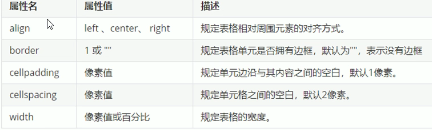

[TOC]


# html&css

## 	一.概述

 1. 评分标准

    html5 0.2; css3 0.5; improve 0.1; project 0.2

	

 2. 浏览器内核 = 渲染引擎

    负责读取网页内容，整理信息，计算显示方式并显示界面

    IE-Trident

    Firefox-Gecko

    Safari-Webkit

    Chrome-Blink(Webkit内核的一个分支)

    

 3. WEB标准

    WSC组织和其他标准化组织制定的一系列标准的集合。**其构成包括结构/html，表现/css和行为/js，并且其提出最佳实践为三个构成元素相分离**


## 二. HTML标签

1. 语法规范

   文件必须基于骨架标签，vscode快捷键为!，安装一下open in browser和auto rename tag[前后一块变化]和css 插件

   ```
   <html>
   	<head>
   		<title></title>
   	</head>
   	<body>
   	</body>
   </html>
   ```

   

2. **骨架标签**的其他内容

   ```
   <!DOCTYPE html> #声明版本为H5。必须第一行，不属于HTML的一部分，属于文档声明标签
   <html lang="en"> #html标签包裹整个内容 lang属性只对浏览器做提示作用，和显示无关。推荐我们的ch-ZN
   <head>
       <meta charset="UTF-8"> #meta用于定义标准不包含的标签属性，charset一定要写，提示使用的字符集。
       <meta http-equiv="X-UA-Compatible" content="IE=edge">
       <meta name="viewport" content="width=device-width, initial-scale=1.0"> #这两行在移动端开发时用处较大，以后再说。
       <title></title>
   </head>
   <body>
   </body>
   </html>
   ```

   

3. 常用标签和语义（注意语义，不要只用div...）

   A. **标题标签**

   ​	分为h1-h6，用以强调，每个标题都会加粗并**独占一行**。

   ```
   <h1>一级标题</h1>
   ```

   B. **段落标签**

   ​	段落之间会添加一个空行。同时会随浏览器窗口大小调整（文字不会超出视窗）

   ​	VSCode-查看-自动换行；在网页中，空格只会被当做一个显示，回车会被忽略。

   ```
   <p>一个段落</p>
   <p>第2个段落&nbsp;&nbsp;中间有两个空格</p>
   <br >
   换行显示该行
   ```

   C. **文本格式化标签**

   ```
   <strong>加粗</strong> 或者b
   <em>倾斜</em> 或者i
   <del>删除线</del> 或者s
   <ins>下划线</ins> 或者u
   推荐使用前者，前者语义更强一些
   ```

   D. **div和span**

   ​	用于布局的容器，

   ​	div指分区，**一个独占一行**，可以看成一个大盒子。

   ​	span指跨距，**一行可以放很多个，默认以空格边距分割**，可以看作小盒子。往往放到div里面。

   ```
   <div>
       盒子A
       <span>盒子1 盒子1和盒子A间会有一个空格，来自span</span>
       <span> &nbsp;盒子2 这次前面有2个空格</span>
   <div>
   <div> 盒子B </div>
   ```

   E. **图片标签**

   ​	注意是单标签。宽高和边框宽的单位是朴素的dp，实例中只修改一个用于保证比例。

   ```
   
   ```

   F. **链接标签**

   ```
   <a href="#" target="_self">  </a>
   ```

   href包括外部链接(http://www.qq.com)、内部链接(./inner.html)、空链接(见上)、下载链接(./file/img.zip)和锚点链接（视角定位到可视单页面网页的某个位置）：

   ```
   <a href="#myLabel" target="_self"> 跳到本页面中myLabel位置 </a>
   <!-- put it somewhere this page: -->
   <h3 id="myLabel"> 可以定位到这里 </h3>
   ```

   target定义了打开方式，包括\_self和\_blank（本页面打开和新建标签页）

   G. **注释标签** 

   ​	快捷键ctrl + /

   H. **特殊字符**

   ​	

   I. **表格**

   ​	---表格的使用，行、格、样式

   ```
   <!--table; 行为tr, 格为td，th和格是同级的
   	表格属性请通过css设置，了解下面的图里面table的内嵌属性
   -->
   <table align="center" border="1" cellpading="20" cellspacing="0" height="200">
   	<tr>
   		<th> 表头,文字自动居中加粗显示 </th>
   		<th></th>
   	</tr>
   	<tr><td>格内文字</td><td></td></tr>
   </table>
   ```



​			---表格的结构

​			头部区域（thead，注意th是单元格，thead是行以上单位，大区域）和主体区域

```
<table>
	<thead>
		<tr><td>...</tr>
	<thead>
	<tbody>
		<tr><tr>...</tr>
	</tbody>
<table>
```

​			---表格的合并单元格

​			关于跨行合并和跨列合并，在目标单元格写合并代码，即跨行的上面和跨列的左边，之后删去多个单元格即可。同时跨行和跨列两个属性同时写。基本上就是按行看，跨的省去就行了。


```
<!--上面的合并作为例子：-->
<table>
	<tr>
		<td></td>
		<td colspan="2"></td>
	</tr>
	<tr>
		<td rowspan="2"></td>
		<td></td>
		<td></td>
	</tr>
	<tr>
		<td></td>
		<td></td>
	</tr>
</table>
```

​		J. **列表**

```
<!--无序列表。极其重要的布局内容-->
<!--ul中只能放置li, 后面的dl和ol也是不能有其他标签。其他标签只能放到li里面。默认样式为小黑点，css控制，先不用管-->
<ul>
	<li>列表项1<li>
	<li>列表项2<li>...
</ul>

<!--有序列表（使用比较少），默认样式为前置1.2.3.,还是先不用管哈->
<ol>
	<li>列表项1<li>
	<li>列表项2<li>...
</ol>

<!--自定义列表，没有任何项目符号。往往不大整齐包含缩进-->
<dl>
	<dt>名词1<dt>
	<dd>名词1的分词1</dd>
	<dd>名词1的分词2</dd>
	<dt>名词2<dt>
	<dd>名词2的分词1</dd>
	<dd>名词2的分词2</dd>
</dl>
```

​		H.**表单**

​			用于收集用户信息。包括表单域（大视窗）、表单控件、提示信息。下面的代码中各个对		应的是谁呢

```
<form action="url地址-用于指定接受或处理表单数据的服务器程序url, 比如demo.php" 
	method="提交方式 get/post.."
	name="名称，用于区分表单域"> 
	<!--https://blog.csdn.net/banjing_1993/article/details/77982423-->
	<input 
		type="属性值，参考下图1" 
		name="名称，用于区分表单元素名，一组单选按钮的name必须一样，主要后台使用" 
		value="表单的值，用于向后台传递，同时指定显示的默认值"
		checked="规定此元素在首次加载时应该被选中"
		maxlength="规定输入字符的最大长度">
		提示性文字，和value区分
	</input>
</form>
```


​			提交按钮调用submit函数，传递的键值对为标签属性值name-value。

​			其他表单元素包括select表单和textarea表单的内容。

```
<select>
	<option selected="selected">下拉选项1</option>
	<option>下拉选项2</option>
</select>
<textarea cols="50" rows="5"> <!--默认显示空间。实际开发不用，使用css-->
	默认显示的文字，还是使用name-value获取，同text
</textarea>
```

​			label标签用于绑定表单元素，当点击文本时可以等价于对应的表单元素，就是把他的for属性搞成id属性就行了。

​		I. MDN:https://developer.mozilla.org/zh-CN/；W3School:https://www.w3school.com.cn/

​		

## 三. 认识CSS-选择器、文字和字体、调试工具和emmet

 1. **简介，语法规范**

    html关注网页的语义，css关注网页外观。全称为层叠/级联样式表，是一种标记语言。总是包括选择器(html标签)和声明(属性map)两个部分。书写时不要挤到一行，语言不分大小写但是推荐小写。

    ```
    <head>
    ...内嵌样式默认位置：
    <style> 
    	p { 注意空格放置
    		color: red;
    		font-size: 12px;
    	}
    <style>
    </head>
    ```

    

 2. **css选择器**

    选标签用的，包括四大类等基础选择器和复合选择器

    ```
    1. 标签选择器
    div {
    	color: blue
    } 将所有div标签字体变为pink
    
    2. 类选择器（最为常用）
    .red-color {
    	color:red
    }
    调用：
    <li class="red-color">所有特定类标签字体变为红色<li>
    
    3. 多类名选择器
    类名必须使用空格分割
    .font35 {
    	font-size: 35px;
    }
    调用：
    <div class="red-color font35">所有特定类标签字体变为红色和字号35<li>
    
    4.id选择器 双向的单一对应。不存在多映射的情况
    #red-color {
    	color: red
    }
    <div id="red-color">所有特定类标签字体变为红色<li>
    
    5.通配符选择器 将所有标签内外边距和padding清除，该标签同标签选择器，不需要被调用：
    * {
    	margin: 0;
        padding: 0;
    }
    ```

    

 3. 使用类选择器画盒子：从上到下一列依次是红色绿色红色的方块

    ```
    ...
    <style>
    .box {
    	width: 100px;
    	height: 100px;
    }
    .red {
    	background-color: red;
    }
    .green {
    	background-color: green;
    }
    <style>
    ...
    <div class="box red">...</div>
    <div class="box green">...</div>
    <div class="box red">...</div>
    ```

    

 4. **css文字和字体**

    ```
    body { //常常放到body标签选择器里面
    	font-family: 'Microsoft Yahei', Arial; //定义字体系列
    	font-size: 20px; //chrome默认为16px
    	font-weight: 700; //等价于font-weight:bold, 推荐该属性写数字,100-900
    	font-style: italic //枚举值，分为normal和italic
    	line-weight: 26px //行间距，注意该属性变大的话文字高度不会再变(font-size),是上面和下面的间距变大。这里指三个的总值为26px
    }
    以上font四条内容可以作为简写, 空格隔开，不能颠倒，size和字体是必要的：
    body {
    	//font: font-style font-weight font-size/line-height font-family
    	font: italic 700 20px/28px 'Microsoft Yahei', Arial
    }
    h2 {
    	font-size: 24px //标题需要手动指定大小，css按前后顺序执行。
    	font-weight: 400 //等价于font-weight-normal
    }
    
    文字：
    div {
    	color: #FF0000 //设置文字颜色
    	text-align: right //文字相对于父布局的对齐方式，只限于水平，是左右中的枚举
    	text-decoration: underline //装饰枚举，包括下划线，上划线(overline),line-through，none
    	//这个decoration的none属性可以用于去掉a标签下划线
    	text-indent: 20px //段落首行缩进，常设为2em，一个em是当前元素一个文字的宽度。
    	//实际开发中，应该优先使用padding（五.2）而不是text-indent。
    }
    ```

    PS：一个量屏幕像素的小工具：FSCapture。chrome应该也有插件。

    

 5. **css的引入方式**

    A.head里面最后放到style子标签内。理论上可以放到任何地方。见上，称为*内部样式表*，作用域为整个html页面。

    B.*行内样式表*只用于修改简单的样式
    
    ```
    <p style="color: red; font-size: 20px;">..</p>
    ```
    
    C.*外部样式表*用于复杂样式和综合，最为常用
    
    ```
    //out.css
    .out {
    	font-size: 20px;
    	color: red;
    }
    ```
    
    ```
    //html位置处于head标签 内容为link
    <link rel="stylesheet" href="/path/to/out.css"></link>
    ```
    
    
    
 6. 综合案例：新闻页面（P88-91）。略。

    chrome调试工具使用：

    ​	右键检查，选择elements。通过直接改动左边html和右边的style查看不同

    emmet语法：
    
    ​	使用缩写形式快速生产html/css。使用标签加tab快速写，使用*n加tab写多个标签，使用>表示包含，使用+表示兄弟关系，使用.xxx加tab书写div+xxx类名标签，使用#啥的是一样的，这个玩意前面可以表示标签名替换默认的div，$加tab表示序号排序生成标签。直接使用{}在标签中书写内容：
    
    ```
    ul>li*3 : <ul><li></li><li></li><li></li></ul>
    div+span : <div></div><span></span>
    .nav : <div class="nav"></div>
    p#nav : <p id="nav"></p>
    .nav$*3 : <div class="nav1"></div><div class="nav2"></div><div class="nav3"></div>
    h1{er} : <h1>er</h1>
    考试：div{outer text $}*5>.style$
    ```
    
    css按首字母+tab即可书写：比如text-intent就ti+tab。w100+tab->width: 100px;
    
    代码快捷键shift+alt+F。
    
    自动格式化可以选择文件-首选项-设置搜索emmet.include找到settings.json,输入\*editor.formatOnType\*:true, \*editor.formatOnSave\*:true。但是我不推荐你用。
    
    
    
 7. 复合选择器

    将基本选择器组合到一起：主要包括后代选择器，子选择器、并集选择器、伪类选择器等

    ```
    A 后代选择器：
    需求：选择所有ol中的li们, 选择nav样式的ol里面的a
    ol>li*3
    ol.nav>li>a
    实现：使用空格直接分隔标签。也可以是孙子，只要是后代都可以选到
    ol li{
    	...
    }
    .nav li a{
    	...li可以省略，但不推荐
    }
    
    B 子选择器：
    和A的区别在于非直代的(不是儿子)不会被选，把空格换成大于号就行了：
    
    C 并集选择器（重要）：
    实现：使用,直接分割标签,可以和其他复合和基本选择器一同使用
    ul, div, .className li{
    	font-family: 'Microsoft Yahei', Arial;
    }
    
    D 伪类选择器：
    用于添加效果，用:表示
    举例：
    链接伪类选择器：<a>...</a>
    a:link 选择未被访问的链接: a:link{ color: black; text-decoration:none;}
    a:visited 选择被访问过的链接
    a:hover 选择被鼠标经过的链接
    a:active 选择按下但是没有弹起的链接 
    ***重要：这四种链接选择器的顺序不能颠倒，链接的样式不会被body覆盖，需要单独定义***
    其他标签也可以。比如div:hover
    focus伪类选择器：<input...>...</input>选取获取焦点的表单元素（光标在哪里）
    input:focus{
    	background-color: red;
    }
    ```
## 四. CSS实践-元素显示模式，背景，特性

 1. 元素显示模式

    html标签以什么方式进行显示，总体分为块元素，行内元素两种类型。行内块元素比较特殊。

    A. 块元素

    h1-h6, p, div, ul, ol, li

    自己独占一行，可以设置高宽和内外边距，<font color="red">宽度默认为100%</font>，可以放行内或者块元素(除p和h标签里面不能再放块)

    B. 行内元素

    a, strong, span, b, em, i, del, s, ins, u

    可以在同行显示，<font color="red">不能直接设置宽高(wrap-content)</font>，里面只能放行内元素(除a不能放a且a可以放块级元素)

    C. 行内块元素

    img, input, td

    一行可以有多个，<font color="red">可以直接设置宽高，默认是wrap-content</font>，里面只能放行内元素

    D. 显示模式的转换

    当一个元素需要使用另外一个显示模式的特性，可以使用display: block设置为块级元素，使用display: inline转换为行内元素，使用display: inline-block转换为行内块元素。

    a {
    	width: 100px;
    	heigth: 50px;
    	display: block;
    	line-height: 50px;//单行元素垂直居中：让文字行高和盒高相等
    }


​    

 2. snippaste下载地址：https://zh.snipaste.com/。F1截图，F3贴顶，esc取消，alt取色(shift切换取色模式)

    两个小练习（完全仿照它）：

    

    

    

 3. CSS背景

    ```
    div {
    	background-color: red; //默认为transparent
    	background-color: rgba(0,0,0,.5); //最后一个是透明度，这个是黑色半透明
    	
    	background-image: url(/path/to/img); //默认为none, 注意url且不加引号, 背景颜色和图片不冲突，图片会压住颜色（透明部分会显示出颜色）
    	background-repeat: no-repeat; //背景图是否重复以平铺整个区域。默认repeat,还有repeat-x、repeat-y
    	background-position: left top; //指定背景图片的对齐方式，跟方位名词，和顺序无关（此处指左上对齐，还有center(默认) right bottom）; 考虑大图和小图两种情况。
    	background-position: 20px, 50px;//该属性可以为x y精确坐标, 分别为距左侧和上边的像素值。默认为居中。也可以坐标和方位方式混合使用：20px right;
    
    	！！！小的装饰性图也一般使用背景的方式，容易调整位置，而不是插入img
    	
    	background-attachment: fixed; //或者scroll,固定或随拖动滚动。
    	//复合写法，没有顺序要求，习惯为颜色 图片 平铺 滚动 位置
    	background: pink url(..) repeat-x scroll 20px 50px
    }
    ```

    

 4. CSS三大特性

    层叠性：定义服从就近原则，冲突时和结构离的近的会优先遵循

    继承性：子标签会继承父标签样式，常见于文字等，不在于高度等宏观属性

    优先级：选择器相同，执行层叠性；选择器不同，按优先级执行：

    ​	继承 < 元素选择器 < 类/伪类选择器 < id选择器 < 行内样式\<style\> < !important

    ​    在复合选择器中，权重会叠加，直接相加，不会进位（严格的阶级）。

    ```
    div>p
    div{
    	color: green!important;
    	font: 12px/24px 'Microsoft Yahei'
    	或者：font: 12px/1.5 'Microsoft Yahei' //行高为当前字体大小的1.5倍。常用于继承情况。
    }
    
    //一个非常典型的练习题: inner的颜色要求改为红色，outer里面其他li的颜色要求改为绿色
    <ul class="outer">
    	<li class="inner">
    	<li>
    //问第二行的.outer删去行不行。为社么
    .outer li { color: green;}
    .outer .inner { color: red;} 
    ```


## 五. CSS-盒子组成、边框和阴影

 1. 导读

    <font color="red">**页面布局的三大核心：盒子模型、浮动和定位**。</font>布局网页本质是填充盒子和内容、设置样式和位置

    

 2. 盒子的四大组成

    包括边框(border)、内(padding)外(margin)边距、实际内容(content)四大部分。

    

    ```
    //四大组成的解释
    div{
    	w100;h50;
    	//边框包括粗细、样式、颜色, 简写border: 5px, solid, red; 会影响盒子实际大小，需注意额外计算
    	border-width: 5px;
    	border-style: solid; //solid指实线边框，dashed指虚线，dotted指点线。
    	border-color: red; 
    	border-top: 1px, solid, green;//可以分开书写上下左右边框，服从层叠性，没有特别优先级
    	border-collapse: collapse; //合并相邻的边框，不会出现重叠重复相加的问题
    	
    	//内边距padding包括四个边距的设定，会影响盒子实际大小（注意宽高需要适应）;
    	padding-top: 30px; //left/right/bottom
    	//复合写法为上 右 下 左（顺时针）。一个值为全部，两个值为上下\左右，三个值为上\左右\下
    	padding: 30px 30px 20px 30px;
    	//在实际实现中，由于行内块宽度默认为wrap-content，我们可以只使用padding进行设定
    	//如果块盒子没有指定宽高(默认为match-parent)，则padding不会撑开盒子。只要指定了（甚至写出width: 100%）就会撑开。
    	
    	//外边距margin。简写和附加影响和padding一样
    	margin-top: 30px;
    	margin: 0 auto; //左右外边距为auto可以实现块级盒子水平居中，设置为0可以清除某些标签自带的内外边距。注意width一定要指定。（见padding最后）
    	//使得行内元素或者行内块元素水平居中不能使用margin方式, 应该把他们父亲搞成text-align: center
    	//外边距的塌陷问题：父元素和子元素都有上外边距，则父元素会塌陷较大的外边距值。
    	//解决方案：1. 为父元素添加上边框 2.为父元素添加上内边距 3.指定overflow属性
    	.father{
    		1.border: 1px solid transparent;
    		2.padding-top: 1px;
    		3.overflow: hidden;
    		margin-top: 2px;
    	}
    	.son{
    		margin-top: 1px;
    	}
    	
    }
    ```

    总结: 注意重复边框、塌陷问题、简写和水平居中的技巧即可。

    其他：使用PS测量和切图：通过Ctrl + R调出标尺，将单位改为像素、放大或者缩小或使用选区进行测量或者取色等切图（将设计稿改造提取并便于书写页面的操作）。

    

 3. 去掉li前面的小圆点：

    ```
    li {list-style: none; }
    ```
    
    
    
 4. 圆角边框和阴影

    ```
    border-radius: 10px; //后面跟半径或者百分比（宽度和高度的百分比）。可以用于画圆。
    border-radius: 10px; 20px; 30px 40px; //分别是左上开始顺时针的角
    border-top-left-radius: 10px;
    box-shadow: 10px 0px 10px 10px black inset;//水平阴影相对位置 垂直阴影相对位置 模糊距离 阴影尺寸 阴影颜色 内部阴影（可选, 默认为outset，不能写出来但是）
    text-shadow: 10px 0px 10px black; //水平阴影相对位置 垂直阴影相对位置 模糊距离（可选） 阴影颜色（可选）
    ```

    

## 六. CSS-浮动

 1. CSS提供了三种传统布局方式，一个完整网页基本都包括了这三种布局，即标准、浮动和定位

    A.普通（标准/文档）流: **指标签按规定好的默认方式进行排列**，比如块级元素独占一行，行内元素行内排列等

    B.浮动：float属性用于创建浮动框，将其移动到一边、直到左或右边缘触及包含块或另一个浮动框的边缘。**不会像frame布局一样包含**

    

 2. 解决什么问题？

    标签的<font color="red">**相对位置**</font>怎么确定（对齐）？怎样突破标签的默认设定？

    

 3. 使用

    ```
    div {
    	float: left; //三个属性 left right none
    }
    一般采用的重要策略是先用标准流的父元素排列上下位置，之后内部子元素采用浮动排列左右位置。用于避免以浏览器窗口为父做相对浮动
    ```

    

 4. 重要特性

    A. <font color="red">脱离标准流的控制，不再保留原来的位置（由其他标准流占有）</font>

    引论：浮动和标准流交替使用可能会导致重叠的布局。即浮动在z轴上的位置偏上。

    B. <font color="red">浮动元素一行紧密显示，除非父级元素的一行难以容纳</font>

    引论：浮动元素具有行内块元素特性（可以设置宽高（默认wrap-content）但是同行），因此行内元素浮动不需要指定行内块属性

    

 5. coding

    

 6. 

    
