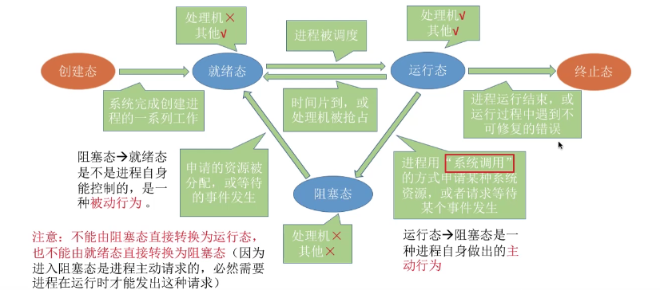
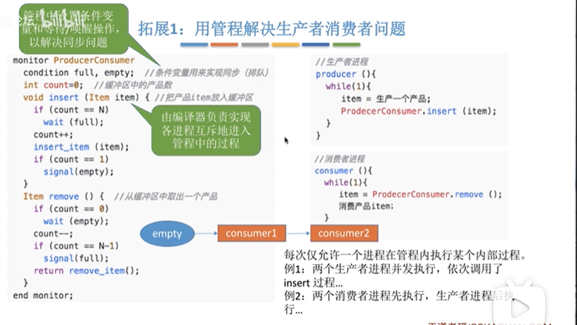
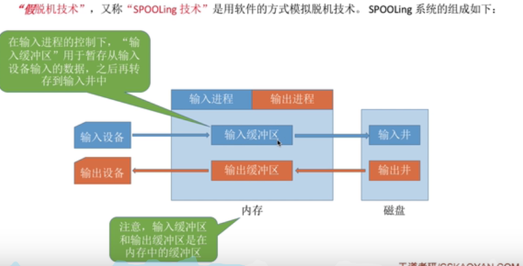
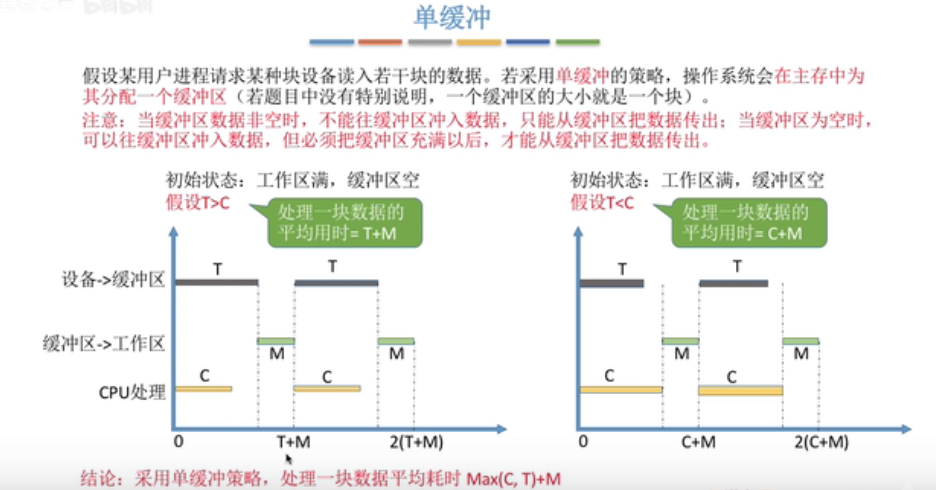

[TOC]

视频地址：https://www.bilibili.com/video/BV1YE411D7nH?p=25

### 一. 介绍-操作系统概念，功能、基本特征、历史

 1. 概念：

    控制和管理调度资源，并提供接口和环境。在裸机之上，目标是对于硬件机器的拓展。

    

 2. 功能：

     1. 作为系统资源的管理者：处理机（CPU）管理，存储器管理，文件管理，设备管理

     2. 作为用户和计算机硬件间的接口：提供命令接口和程序接口。

        a. 命令接口：分为联机命令接口（同步执行每句指令，比如cmd的time指令）和脱机/批处理命令接口（异步执行批次指令，比如.bat文件）。

        b. 程序接口：只能通过用户程序间接使用的接口（比如.DLL的系统调用），一般，系统调用=广义调用=程序接口。

        3. GUI
        
           

 3. 基本特征：

    1. 并发：两个或者多个事件在同一时间间隔内发生，并行是指多个事件在同一时刻同时发生

    2. 共享：系统中的资源可以供多个并发执行的进程共同使用

       a. 互斥共享：同一时间段只允许一个进程使用

       *互斥访问的逻辑：顺序为进入区（上锁的阶段）；临界区（访问临界资源的代码） 退出区 （解锁的阶段）；剩余区；并遵守空闲让进，忙则等待，有限等待和让权等待原则（以后还会涉及，不再展开）*

       b. 同时共享：同一时间段允许多个进程使用

       并发和共享互为存在的条件

    3. 虚拟：把物理上的实体对应为若干逻辑上的对应物

       比如只有4G的内存可以支持运行内存总额大于4G软件同时运行（虚拟存储器和空分复用技术，以后会重点讲解）

    4. 异步：因为资源限制，进程执行不会一贯到底，而是不可预知的

       并发和共享是虚拟和异步的存在条件
       
       

 4. 发展和分类：

    1. 手工操作阶段

       处理速度快，输入输出极慢（人工输入打点带），资源利用率低。

    2. 单道批处理系统

       计算机依靠监督程序从磁带读入，提高了处理速度和资源利用率（就是一次处理许多指令），但是仍然是串行的。

    3. 多道批处理系统

       把多个磁带放进去。真正意义上的OS诞生，调度程序会调度所有输入磁带的执行，是最早的流水线（输入、计算、输出模块可以保证一直工作而不用一直等待）。缺点就是没有提供人机交互。整个作业过程是一个黑盒。

    4. 分时操作系统

       计算机以时间片为单位轮流为用户作业/服务，用户可以通过终端与计算机交互。但是没有任务优先级。

    5. 实时操作系统

       能够相应一些紧急的任务，不需要时间片排队，保证了及时性和可靠性。按照是否允许小的时间规定差异分为硬实时系统（飞控）和软实时系统（抢票）。

    6. 其他：网络OS 分布式OS 个人OS
    
       

### 二. 指令分类、中断和异常、系统调用

1. 指令和内核的分类：

   A 特权指令（处于核心态，往往是内核程序在负责运行该种指令，可以执行如内存清零等操作）

   B 非特权指令（处于用户态，不能执行特权指令）。

   一般的，临近硬件层次的内核负责的相关功能（时钟管理，中断管理和原语（一种特殊的程序，最接近硬件的具有原子性的程序，如设备驱动，CPU切换等）、【进程管理，存储器管理，设备管理】等）一般使用特权指令定义。一些操作系统并不把方括号内的功能放到内核中，我们称之为微内核，反之称之为大内核。

   微内核内核功能少维护方便，但是需要频繁切换两态，性能就相对低。各有优劣。

   

2. 两态判断：

   使用PSW（程序状态寄存器）中的某个位来判断是在 哪个态

   

3. 中断是什么：

   中断的本质是指发生即需要OS介入开展管理工作，流程是CPU收到计时部件发出的中断信号，切换为核心态由OS内核对中断进行处理，切换进程运行。

   **重复一遍，当中断发生，CPU立即进入核心态，当前进程立即停止运行。并由OS内核进行处理。并且，中断是用户态到核心态的唯一途径。**

   而核心态到用户态只需要执行设置PSW（程序状态字）的特权指令即可

   

4. 中断的分类

   A. 内中断-中断信号来源于CPU内部，也称为异常、例外、陷入。分为指令中断（系统调用）和强迫中断（硬件故障（缺页）或者软件中断（除以0））

   *也可以分为陷入（有意的，如系统调用），故障（如缺页），终止（不可恢复的错误）*

   B. 外中断-信号来源于CPU外部，狭义概念上的中断。包括外设请求（如IO）和人工干预（如用户终止）两方面。CPU在执行完每条指令之后都需要检查外部中断信号。如果检测到，需要保护被中断进程的CPU环境，之后根据中断信号类型转入中断处理程序，运行完成后恢复环境即可。

   

5. 系统调用

   OS面向用户的接口称为命令接口，那么**面向应用程序的接口则称之为程序接口，又称系统调用，它实现的是对资源的控制，必须在核心态完成**；凡是和资源相关的都需要使用系统调用，高级语言（如C）的某些库函数封装了系统调用，因此开发者系统调用往往使用这种形式

   ```
   //举例: write()
   编译执行汇编，将参数放入寄存器mov，之后执行trap指令int导致切换到核心态。
   ```

   因此核心态下唯一一个不能执行的指令是陷入指令

   

### 三. 进程-组织, 状态和控制

 1. 背景

    计算机中出现多道程序的数据存放和并发执行的需求。为准确找到各个程序的存放位置。操作系统为每个运行的程序配置称之为PCB（进程控制块）的数据结构，用来存放诸如程序代码位置之类的信息。

    

 2. 定义

    进程实体包括程序段（指令序列）、数据段、PCB，他被简称为进程（n）。创建和撤销进程，就是PCB的创消过程，**PCB是进程存在的唯一标志**。

    我们可以说，进程（v）是进程实体的运行过程，是程序的一次执行过程，是**系统资源分配的调度的基本单位**，它的核心特性在于**动态性**

    综上，进程拥有动态性 独立性 并发性 异步性 结构性

    

 3. PCB的组成

    进程描述信息（进程标识符PID和用户标识符UID）、 进程控制和管理信息（当前状态和优先级）、资源分配清单、处理机相关信息（各种寄存器值，用于恢复结果）

    

 4. 进程的组织

    多个进程间的组织方式分为两种类型

    链接方式-按照进程状态将PCB分为几个队列，OS持有指向各个队列的指针（比如执行指针、就绪队列指针、阻塞队列指针）

    索引方式-根据进程状态分为几个索引表，OS持有指向各个索引表的指针

    

 5. 进程的状态

    三种基本状态：运行态（处理机处理中）、就绪态（已经**拥有除了处理机（CPU）**外的所有资源）、阻塞态（所**需除处理机的其他资源**被其他响应占用）

    两种额外状态：创建态（资源分配和PCB初始化等）、终止态（资源等的释放中）

    **状态转换**

    

    A. 运行态到阻塞态是主动行为（主动请求资源而未得），阻塞态到就绪态是被动行为（资源被他方释放）。

    B. 阻塞态和运行态不能直接转换。

    

 6. 进程的控制

    可以简单理解为进程状态间的转换。进程控制使用原语控制，**原语使用关中断指令和开中断指令（显然是特权指令）保证原子操作，因而它必然运行在核心态。**
    
    
    
 7. 控制原语的分类

    总体来说包括三类：***更新PCB中的信息（修改进程状态标志，保存运行环境到PCB，从PCB恢复运行环境）、将PCB插入队列、分配/回收资源***

    从时间来看分为创建原语、撤销原语、阻塞-唤醒原语(成对使用)、切换原语五种。详细内容参考进程的队列模型等理解，在这里不再多列。

    

    

### 四. 进程-通信、线程和调度

 1. 通信

    进程内存地址空间相互独立，一个进程不能直接访问另一个进程的地址空间。这破坏了独立资源分配的概念。OS为进程通信提供了**共享存储、管道通信

    A. 共享存储包括基于数据结构的存储和基于共享区的存储，前者规定了特定共享空间只能使用固定的数据结构。后者则有进程而不是OS决定数据形式和位置，运行较快。

    B. 管道指用于连接读写进程的一个读写文件，又名PIPE文件。**单管道是半双工的，各个进程必须互斥地访问管道，而且数据是一次性的**（意味者读进程同时只有一个）。

    C. 消息传递机制以格式化消息(Message)为单位，进程**通过OS提供的发送/接受消息两个原语进行数据交换**，间接通信的方式不会将消息直接挂到接受消息的缓冲队列，而是先发送到中间实体（称为信箱）

    

 2. 线程和线程模型

    线程**只是用于提升进程并发度的运行实体**，它的静态概念对应为线程调度块和线程ID，动态概念也有就绪、阻塞、运行的状态，和进程非常类似。线程是程序执行流的最小单位。从设计思想来说，线程和进程将资源和调度进行了单向解耦；从而达到同资源实体的内部调度专注于行为，大大节约了相关动作的开销。

    线程包括用户级线程（ULT，user level thread，由用户空间的线程库管理，OS不知道）和内核级线程（KLT，kenel level thread，由OS内核管理，用户不知道），实际处理中常常将N + d个用户级线程映射到N个内核级线程中，**这种映射规则引申出了多对一、一对一、多对多的多线程模型分类。其优缺点取决于两态切换和并发能力间的制衡**，容易理解。

    *段落2：同一进程内的不同线程可以运行在多核CPU的不同核上吗？*

    

 3. 调度的概念

    ---背景：处理机数量小于进程数量，需要确定进程使用处理机的先后顺序。

    ---调度层次：

    高级调度：**外存向内存的调入和调出，调入时建立PCB，调出时撤销PCB**，而重点在调入时机的管理（跑完了就调出）。

    中级调度：**内存向虚拟内存的调入和调出，将不能运行的进程调至外存等待，而PCB常驻内存，称为挂起状态**。提高内存利用率和吞吐量。显然，重点还是在于调入时机，其频率远比高级调度要高（虚拟内存的空间比较充足）。中级调度只是为了减轻系统负载

    Interval:

    包含挂起状态的七状态模型。出入点显然在中间的3个运行态。和高级调度的区别就是***PCB的位置***，和阻塞态的区别在于***进程映像的位置***。

    

    低级调度：**内存向CPU的调入和调出**。从就绪队列中选取进程，将处理机分配给他。一般在秒级别。

    总结：

    

    

 4. 进程调度（低级调度）的时机

    进程**主动（正常或异常终指，主动阻塞/IO.etc）或者被动放弃（时间片用完或紧急中断或高优先级进程进入就绪队列）处理机**。被动方式不允许的话称为非抢占方式，一般只适用于早期批处理系统。

    在处理中断时，或者在OS内核程序临界区（指访问临界资源的代码）中，或在原子操作过程（原语）中不能做调度切换。

    内核临界区限制的原因是**调度程序也需要访问资源，显然非内核临界区是可以访问的**。

    

 5. 调度算法

    A. 评价指标

    ​	---CPU利用率：忙碌时间/工作时间

    ​	---系统吞吐量：单位时间内完成作业的数量（道/秒）

    ​	---作业周转时间：作业提交到完成的时间（包括调度等待的时间），平均周转时间指作业周转时间和/作业数目；**带权周转时间指作业周转时间/作业实际运行的时间**（这个值显然>1）同样的还有平均带权周转时间；

    ​	---作业等待时间：作业等待处理机的时间之和，包括建立进程后的等待服务的时间和作业在外存后备队列中的等待时间；他是周转时间减去运行时间减去IO等服务时间

    ​	---响应时间：从用户提交请求到首次产生响应所用的时间；

    

    B. 早期批处理系统调度算法-不关心响应时间，不够现代

    ​	***注意考察的点： 思想、规则、作业调度还是进程调度、抢占还是非抢占、优缺点、是否会导致饥饿。阅读一定明确以上问题***

    ​	<font color="red">FCFS（先来先服务）</font>: **本着公平的思想，按照作业/进程到达的先后顺序依次调入内存，非抢占**。一般的，作业调度为就绪队列顺序，进程调度为挂起队列顺序（这里和以后普遍以作业为代表，以后的调度算法不提及进程）；公平简单且不会饥饿，但对后排短作业非常不利。

    ​	<font color='red'>SJF（短作业优先）</font>：**追求最小平均等待时间**，还是作业和进程（SP*[rocess]*F）调度都适用的算法。要求**为已到最短的作业先服务，默认非抢占**，抢占式版本称为**SRTN（最短剩余时间优先）; 唯一的区别在于每当有一个新的进程进入就绪队列的时候就要依最小判断进行抢占动作。**抢占方式的等待时间/周转表现又要优于SJF，但是显然会耗费更多的调度资源。对短作业有利，但可能产生长作业饥饿问题。

    ​	<font color='red'>HRRN（高响应比优先）</font>：**追求平均等待时间和要求服务时间的均衡。选择响应比最高的作业服务**（响应比 = 已等待时间 + 预计运行时间 / 预计运行时间），作业和进程调度都适用。从而解决了长作业饥饿的问题。**非抢占**。结合FCFS和SJF，使用计算资源更多但更公平。

    *举例：到达时间2s，预计运行时间4s、现在时刻为7s。则现在时刻响应比为 5 + 4 / 4 = 2.25*

    

    C.交互式系统调度算法

    ​	注意点和上个小节一样，区别在于等待时间和周转时间不再计算，只关注响应时间。

    ​	<font color='red'>RR（时间片轮转）</font>：公平的轮流为各个进程服务，轮流让各个进程执行一个时间片t0，由时钟中断控制。**只适用于进程调度（首先要在内存中存在），抢占式算法**。t0过大则退化为FCFS增大响应时间，太小则切换资源消耗大。t0的选择使得切换资源消耗小于1%。公平而响应快。但是没有优先级---

    ​	<font color='red'>PS（优先级调度）</font>：**每次选择优先级调度最高的算法，可以用于作业调度和进程调度，分为非抢占（默认）和抢占方式**，分别对应主动放弃处理机和到达时排挤（同SRTN）。可以保证偏好但是可能导致饥饿。

    ​	*就绪队列不仅只有一个。可以按照不同优先级进行组织。优先级包括静态和动态优先级。优先级的判定（比如sys > user，front > deamon, cal > io，动态优先级可以从公平和资源方面调整）*

    ​	<font color="red">多级反馈队列</font>：**用于进程调度的抢占式算法，短进程到达可能饥饿，但是公平响应快而且可以规定偏好**（平衡优秀）；设置多级就绪队列，队列优先级从高到底，时间片由小到大；
    
    ​	新进程到达先进入Q1队尾-按FCFS分配时间片。如用完时间片还未结束则放到下一级的队尾。
    
    ​	只有第k级队列空，才会为k+1级分配时间片；
    
    ​	被抢占的进程回到本列队尾。
    
    ​	如果最后一级还没跑完时间片，回到最后一级的队尾。
    
    *举例：第5s的运行状况*
    
    
    
    

### 五. 进程-互斥和其初步实现

 1. 同步概念

    同步：同步机制保证并发执行的进程**以可预知的顺序执行，是一种直接制约的关系**
    
    
    
 2. 进程互斥的软件实现方式

    A. <font color="red">单标志法</font>

    两个进程在访问完临界区后将权限交给另一个进程。**每个进程进入临界区的权限只能由另一个进程赋予**

    实例：

    

    缺点是违背空闲让进原则，临界区空闲时P0只要不进入便没有可以使用的

    B.  <font color="red">双标志先检查法</font>

    设置bool数组表示进入意愿（想要进入置为true）,检查是否有其他高优先级意愿，否则置true并访问，访问完后置false

    实例：

    

    C.  <font color="red">双标志后检查法</font>

    同B，但是检查在判断之后。同样的，如果按照下图1->5->2->6...会发生两者都无法进入临界区的情况，违背了空闲让进和有限等待原则:

    实例：

    

    我们发现，**进程的异步性是实现算法的最重要矛盾，尤其需要注意是否在进入区执行了非原子的操作，这很容易导致问题**，因此我们引入了下面这种算法：

    D.  <font color="red">Peteson算法</font>

    **同时设置意愿数组和优先度变量，前者同上，而后者用于安排进程表达不优先的意愿**。参考下面这个上厕所的例子。

    

    遵从了空闲让进，忙则等待，有限等待，但是没有遵守让权等待（不能进入临界区时没有立即释放处理机，而是在忙等待）

    

 3. 进程互斥的硬件实现方法

    A. <font color="red">中断屏蔽方法</font>

    关中断指令执行->临界区->开中断指令执行。不适用于多处理机和用户进程

    B. <font color="red">TSL/TS指令(TestAndSet)</font>

    **由硬件完成的指令，规定执行进程不可被中断**。实现互斥的算法逻辑非常简单，但是还是不满足让权等待（还是忙等待）：

    ```
    while(TestAndSet(&lock)); //上锁并检查被硬件变为了原子操作，因此解决了上面软件实现中的问题。
    //TS方法内部逻辑就是lock置为true, 之后返回原来传入的lock值
    critical section...
    lock = false;
    remainder section
    ```

    C. <font color="red">Swap指令</font>

    由硬件完成的指令，**交换两个值**，但是是原子的。和TS指令其实是一样的逻辑，缺点也一样：

    ```
    bool old = true;
    while(old == true)
    	Swap(&lock, &old);
    critial section
    lock = false;
    remainder section
    ```

    

4. 能不能不使用硬件方法，从而使得检查和上锁搞在一起呢？同时能不能解决让权等待问题呢？我们之后需要使用的就是信号量机制。


### 六. 进程-互斥的信号量实现、管程

 1. 信号量机制

    用户进程可以通过一对原语(wait、signal，称为PV操作)对信号量进行操作。从而实现进程互斥和同步。**信号量其实就是一个变量（整型或者记录形），往往用于标志资源的数量**

	

 2. 整型信号量S

    只能进行初始化、P操作、V操作三种动作，P表示S>=0执行进入，否则自旋，V表示S+1（有等待时唤醒在3中介绍，它避免了P的自旋）。重申，S的意义就是资源数目。**不满足让权等待（while表示会出现忙等待）**

    ```
    wait(S):
    	while(S <= 0)
    		S--
    signal(S):
    	S++
    
    S = 10
    //when processes use resource S whose num is 10:
    wait(S) //进入区，亦可称为P(S)
    Operation Section
    signal(S) // 退出区, 亦可称为V(S)
    ```

    

 3. 记录型信号量semaphore

    使用记录型数据结构，没有资源时依托**block原语**将进程挂到信号量的阻塞队列中，使用完时**wakeup原语**唤醒队列中的某个进程，解决了让权等待的问题。**一定要val先变，因为原语的执行可能不是必要的**

    ```
    struct semaphore:
    	val //剩余资源数目
    	processQueue //等待队列，类型是struct process*
    wait(semaphore S):
    	S.val--
    	if(S.val < 0)
    		block(S.processQueue)
    signal(semaphore S):
    	S.val++
    	if(S.val <= 0) //说明等待队列里面有东西，<=0时代表队列里面有东西，唤醒操作才必要。
    		wakeup(S.processQueue)
    		
    S.val = 10
    //when processes use resource S whose num is 10:
    wait(S) //进入区
    Operation Section
    signal(S) // 退出区
    ```

    

 4. <font color="red">信号量机制实现互斥和同步</font>

    对于进程互斥，因为临界区同一时间只允许同一个进程访问，那么**临界区可以看成只有1数目的资源**。之后就是3的重复了。

    ```
    semaphore S = 1
    Px:
    	P(S)
    	critical Section
    	V(S)
    ```

    对于进程同步，设置同步信号量S = 0；在**前置操作之后执行V，后置操作之前执行P。简而言之就是等待前置操作释放资源（给出可操作信号）**。<font color="brown">**这种思想可以推广到使用信号量实现任意的前驱关系，对于依赖树的每一对前驱关系设置一个同步变量即可**</font>

    ```
    举例-代码4的执行依赖于代码段1和代码段2的顺序执行：
    P1:
    	para1 //front 
    	para2 //front
    	para3 
    P2:
    	para4 //back
    实现：
    semaphore S = 0
    P1:
    	para1 //front 
    	para2 //front
    	V(S)
    	para3 
    P2:
    	P(S)
    	para4 //back
    ```

    练习题：写出下列前驱操作树的伪代码。其中，s1->s6分别位于六个独立异步进程中。箭头发出点是被依赖的对象。你可以参考箭头上的黑字定义变量和操作，也可以无视他们。

    ​	

    

 5. 生产者和消费者问题

    生产者放入缓冲区，消费者从缓冲区中取出。缓冲区是临界资源，必须互斥访问。因此我们需要实现**进程互斥和满空判断（同步控制）两个方面**。

    使用PV实现该问题：同本目4，同时设置初值为0的同步信号量和初值为1的互斥信号量。实现时，我们需要找出进程，**分析同步互斥关系，按照互斥加锁，前操后V，后操前P**原则安排代码。

    本问题关系是缓冲区为临界区，拿空时消费者需要等待（同步关系1），写满时生产者需要等待（同步关系2）：

    ```
    semaphore mutex = 1 //互斥信号量
    semaphore empty = n //同步关系1
    semaphore full = 0 //同步关系2
    producer:
    	while true:
    		P(empty)	后P
    		put product -> P(mutex) real action V(mutex) 注意互斥
    		V(full)		前V
    consumer:
    	while true:
    		P(full) 	后P
    		consume product -> -> P(mutex) real action V(mutex) 注意互斥
    		V(empty)	前V
    我们发现单类生产者消费者的同步是交叉代码，互斥是同向代码。可以直接写。
    ```

    多生产者消费者问题，**多应该指的是多类**。**<font color="red">同步资源量需要定义总量和各类分量，之后按照前V后P原则安排代码，至于该PV总量还是分量，就是逻辑的问题了</font>。**

    举例：父亲和儿子只能一个放苹果一个取苹果，母亲和女儿只能一个放橘子一个取橘，盘子大小为一（答案不设置mutex的原因），分析同步关系时，不能从进程角度（比如儿子拿走水果和父亲放入水果）入手，而是要**从资源角度**入手（盘子变空和放入水果）：

    

    

 6. 吸烟者问题、读写者问题、哲学家进餐问题。

    ​	可以复习视频25-27P或者相应文章。都是生产者消费者的典型变体应用，依旧需要从资源事件入手分析同步互斥关系并按互斥加锁、前操后V，后操前P的原则安排代码。如果考试的话需要做典型例题了解。这里不涉及其他知识。不做整理。

    

 7. 管程

    信号量机制编写困难，容易出错或引起死锁等问题，管程同步机制应运而生。

    **管程是实现互斥同步的手段，他是一种特殊的软件模块，包括共享数据结构和一组过程，同时拥有初始化语句和名字，类似于类的概念。**

    其基本特征就是共享数据结构都是私有的，进程只能调用管程的函数对他进行有限更改，而且一次只允许一个进程在管程内执行内部过程。

    ```
    //使用管程实现生产者消费者问题：
    //需要在管程中定义共享数据和访问入口，无需考虑互斥特性（其实现由编译器负责）。可以在管程中设置条件变量或者等待或唤醒操作接近同步问题。
    //这个玩意类似java的synchronized
    ```

    

### 七. 死锁和内存管理的连续分配

 1. 死锁：

    在并发环境下，各个进程因为互相等待资源而导致阻塞，无法向前推进的现象。

    

 2. 处理策略：

    A. 死锁的预防：

    ​	<font color=red>四个必要条件：互斥、非抢占、请求和保持（阻塞请求）、循环等待</font>，预防就是破坏这四个条件不发生，是一个**静态**的过程。

    ​	破化互斥可以使用*SPOOLing技术*。OS使用SPOOLing吧独占设备在逻辑上改造为共享设备。这种手段具有较大局限性。

    ​	破环非抢占可以安排各种抢占机制。缺点在于策略复杂和恢复问题，同时大大降低吞吐量。

    ​	破坏阻塞请求指进程<font color="green">**在运行前申请完全部资源**</font>，持有全部资源可能会导致极低的资源利用率，同时可能导致饥饿。

    ​	破环循环等待可以使用<font color="green">**顺序资源分配法。对资源唯一递增编号，每个进程必须按照编号递增的顺请求资源，同类（即相同编号的资源）一次申请完**</font>。该方案不适合增加新设备和资源，也会大大降低资源利用率。

    B. 死锁的避免：

    ​	这个东西和上面的区别是他**是动态规划的**；一般使用银行家算法：如果银行家借给某个企业的钱达不到它提出的最大要求，那么这些借出去的钱都还不回来了。

    ​    **安全序列**指系统按该序列分配资源，则每个进程都能顺利完成。可以找到安全序列的系统处于安全状态，必定不会发生死锁。不安全状态不意味着死锁一定发生（比如进程会提前归还资源）

    ​	银行家算法的核心在于在资源分配前判断该次分配是否会使得系统进入不安全状态。具体算法会用资源总向量R、最大需求阵M和已分配矩阵A（M-A=Need）枚举寻找安全状态即可：

    ​	

    C. 死锁的检测和破坏：

    ​	和上面两种的区别是它属于发生后行为。使用资源分配图进行检测。包括方形的资源结点和圆形的进程结点。进程指向资源代表请求，资源指向进程表示已经分配。死锁代表圆形的合理消失不能完全消除所有边（不可完全简化）。剩下的边便必然导致死锁。

    

    ​	在图中找到既不阻塞又不是孤立点的Pi，削去它的相关边后得到了死锁状态（图中P1和P2）。之后我们可以通过资源剥夺、撤销进程、进程回退方法进行破坏。

    

 3. 内存的基本知识简要复习（计组哈）

    ​	执行前必须先放到内存中才能被CPU调度，缓解存储和运行的速度差距。每个内存存储单元大小为字长（32位/64位），它对应一个地址。这个地址是物理地址，而编译时产生的指令使用**逻辑地址**（进程在内存中的起始地址为基准的相对地址）。在编译完成后需要装入模块负责内存装入，即完成逻辑地址和物理地址的转换（绝对装入（编译时转换，仅适于单道程序），静态重定位（链接后转换，必须分配其全部内存空间，常用于多道批处理），**动态重定位（运行时，依赖于重定位寄存器）**）。
    
    
    
 4. 内存管理的基本概念

    A. 操作系统负责内存空间的分配和回收

    B. 操作系统从逻辑上从内存空间上进行扩充

    C. 负责逻辑地址和物理地址转换（本目3的三种方式）

    D. 操作系统保证实现内存区域使用互不干扰，实现内存保护；包括设置上下限寄存器和和重定位（基址）寄存器等不同的方式进行越界检查。

    

 5. 内存空间扩充- 覆盖、交换和虚拟存储

    覆盖: 程序大小超过物理内存总和时，将程序分为多个段，常驻内存的段放入内存的固定区，不常用的仅一部分放在内存的覆盖区（需要时再调入进行覆盖）。**现在很少使用了，了解**

    交换: <font color="green">*内存空间紧张时，系统将内存中某些进程暂时换出外存（PCB常驻内存，负责恢复用）*</font>。即中级调度，挂起态（四.3）。由这种功能的磁盘区一般分为对换区（小，追求换出速度，连续分配）和文件区。

    虚拟内存：基于局部性原理（代码频繁访问时间局部和空间局部）**将进程中的某一部分暂时换出外存**，和交换的区别是他是在运行时，即对于一个作业而言。而交换是对于多个作业而言。具体见八.5

    

 6. 连续分配

    ---单一连续分配中，系统被分为系统区（低地址）和用户区，内存中只能有一道用户程序，常使用覆盖技术和无需内存保护（比如dos）。极其简单而低效

    ---固定分区分配中，用户空间被分为若干个固定大小分区，每个分区里面有一道程序，实现最早的多道处理（常见于简单硬件程序）。OS使用**分区说明表**的数据结构管理内存大小，地址，状态。相对简单且不均，**会产生内部碎片（进程分配内存里面有未利用空间）**

    ---动态分区分配中，进程装入内存时会根据进程大小在用户空间动态建立分区。使用空闲分区表/链的DS记录分区大小地址状态，回收时考察是否旁边有相邻空闲进行讨论，使用动态分区分配算法负责分配：它不会产生内部碎片，但是**有外部碎片（非进程分配内存出现难以利用碎片）**，可以通过“紧凑”技术解决。

    

 7. 动态分区分配算法

    <font color="red">A 首次适应算法（效果最好）</font>
    
    每次从低地址开始查找，找到第一个可以满足大小的空闲分区。可以使用空闲分区表/链，比如从空闲分区链表头遍历寻找修改即可。
    
    <font color="red">B 最佳适应算法</font>
    
    按容量从小到大遍历找到第一个可以满足的空闲分区。容易留下许多小碎片。
    
    <font color="red">C 最坏适应算法</font>
    
    按容量从大到小遍历找到第一个可以满足的空闲分区。容易导致大进程难以进入。
    
    <font color="red">D 临近适应算法</font>
    
    第一次从低地址开始，以后每次从上次查找的指针开始向下或循环。减少了查找开销
    
    

### 八. 内存管理的离散分配-分页、分段和段页式；虚拟内存

 1. 分页-物理单位-系统行为

    **将内存分为一个个等大小分区（页框），按分区大小将进程拆分（页面）。页面和页框一一对应**。分区大小越小，内部碎片越小。在地址转换过程中，进程的逻辑地址转换是每个页的起始逻辑地址加偏移量到物理地址，定义逻辑地址大小和页面大小进行计算地址的两个结构变量：
    
    页号 = 逻辑地址 / 页面长度
    
    页内偏移 = 逻辑地址 % 页面长度 ， 因此页面长度为2的整数幂，便于程序计算
    
    操作系统会为每个进程创建一张页表，每个页表项A由页面号和页框号（内存块号）构成
    
    
    
 2. 分页存储的基本地址变换机构

    系统通过页表寄存器存储页表起始地址F和页表长度M, 从而计算逻辑地址A（结构如上1所述）的对应物理地址。

    在这种基本地址变换机构上，引入了**快表（TLB）用于加速地址变换的过程**，它基于局部性原理（代码频繁访问时间局部和空间局部）。**块表是比内存访问速度快很多的高速存储寄存器**，就是一个简单的缓存页号和内存块号的map，判断命中与否而已。

    为了解决**大页表必须连续存放的问题，我们把页表当作进程内容看待建立新的页表，称为2级页表**。包括上面的叫页目录表和下面的二级页表。那么逻辑地址A结构改为包括两个页面号和页框号，同时，**A的结构可以加入一个是否在内存中的标志位和中断结合实现大页表同内存的脱离（虚拟内存）**

    <font color="red">因此我们可以看到，我们只需要关心页表项A的逻辑结构就行了</font>

    

 3. 分段-逻辑单位-用户需求

    进程的地址空间可以按照自身逻辑关系划分为若干个段（MAIN, FUNX...）。用户甚至可以自定义段名，**每个段在内存中占连续空间，但是段间可以不相邻。**

    段表逻辑地址A结构为**段号和段内地址**，前者位数决定进程可以被分为几个段，段内地址位数决定段的大小。

    和页表不同，页表项大小不需要通过表记录，而段表需要**通过总表来记录每个段号-段长-基址的对应关系。**同上，系统通过段表寄存器存储段表始址F和段表长度M计算逻辑地址A，唯一的不同是会通过总表段长对段内地址进行检查。分段也可以引入快表。

    分段更有利于信息共享和保护。

    

 4. 段页式

    分页内存碎片小，但是不容易实现需求、共享和保护，而分段相反。为结合优势，引入了段页式管理，**在分段之后，段还会被再次分页。**

    逻辑地址A结构由段号，页号，页内偏移量组成。<font color="green">**段表由段号（常常是隐藏的），页表长度和页表存放块号组成，页表和以前一样（显然一个进程对应许多页表）。不需再多说了。**</font>

    

 5. 虚拟内存

    七.5；

    三个主要特征：多次性（无需在作业运行时一次全部装入内存），对换性（运行时无需一直常驻内存），虚拟性（从逻辑上扩充了内存容量）。主要关注运行时，需要建立在上面1-4提出的离散分配的内存管理基础之上，增加的是请求调页和页面置换功能。
    
    在虚拟内存实现中，包括请求分页；请求分段，请求段页式存储管理。主要需要关注：见6.
    
    
    
 6. 请求分页存储管理

    执行过程中当访问信息不在内存，由OS将信息从外存调入内存。页表中，新增**内存状态位（是否在内存中，不存在产生缺页中断之后淘汰、调页）、访问字段（最近被访问过几次（供算法参考））、修改位（调入后是否被修改过）、外存地址四列**。加上原来的页面号和内存块号，A的结构至少包括以上六个属性。

    缺页中断属于故障内中断，一条指令显然可能涉及多个缺页中断（多个地址相关）。

    

 7. 页面置换算法

    选择把哪个页面换出内存

    最佳置换（OPT）：优先淘汰以后在最长时间内不会被访问的页面。由于基于未来，不具备现实性。

    先进先出（FIFO）：优先淘汰最早进入内存页面。可能出现Belady异常（为某进程分配的内存块数增大，缺页次数不减反增。因为先进入的也可能被再访问）

    **最近最久未使用（LRU）**：优先淘汰自上次访问以来经历时间最久的。

    时钟置换算法（CLOCK）/最近未用算法（NRU）：LRU和FIFO在效率和实现上的平衡。淘汰的时候进行循环扫描，扫描淘汰第一个访问位为0的页面并将曾经过的页面置零。该算法的改进为在以上基础上增加修改位：

    

    

 8. 页面分配策略

    **驻留集：请求分页存储管理过程中给进程分配的物理块的集合。**使用虚拟存储技术的系统中，驻留集一般为进程大小。比如某进程共有100个页面，则驻留集大小为100时可以全部放入内存。显然，驻留集太小的话会导致缺页频繁，太大导致并发度下降。
    
    根据驻留集大小在运行时是否可变，<font color="red">分为固定分配和可变分配；根据发生缺页时置换出的页面是否只能是进程自己的物理块，分为局部置换和全局置换</font>。显然，全局置换下不可能是固定分配。区分下可变分配全局置换和可变分配局部置换，前者是只要缺页就给分配新物理块，后者根据缺页频率动态增加分配的块
    
    何时调入页面：预调页策略（局部性原理，一次调入相邻页面的策略，常用于进程运行前的首次调入）、请求调页策略（本目6.7.）。
    
    **抖动：刚刚换出的页面马上要换入内存，刚刚换出又要换入的频繁页面调度现象**。主要原因是进程频繁访问的页面数目高于可用的物理块数。
    
    **工作集：某段时间间隔内进程实际访问页面的集合**，相关计算和意义（了解）：
    
    
    
    

### 九. 文件管理-逻辑结构、文件目录、物理结构

 1. 引言

    A. 一组有意义的信息/数据的集合。我们关心文件的内部数据组织（分为无结构文件和有结构文件）和宏观结构（包括CRUDOC(open,close)交互接口和文件间的组织(OS在外存中如何组织文件存储)）；了解文件的共享和保护机制。

    B. 基本属性：文件名、标识符（一个系统内标识符唯一，一般不对用户可见）、类型、路径、大小、时间相关、保护信息；

    

 2. 文件的逻辑结构：用户视角中文件数据如何组织

    无结构文件：二进制或字符的流组成，没啥结构

    有结构文件：由一组相似的记录组成，每条记录由若干项数据组成，每条记录中有一项作为记录长度，又可分为定长记录和可变长记录两种。

    **有结构文件-顺序文件结构：顺序表或链表组织每条记录（参数据结构）**，链式和可变长的顺序存储无法实现随机存取（只能从第一个开始）。默认的，我们说文件顺序存储就是顺序表而不是链式（即物理上也是顺序）。

    **有结构文件-索引文件结构：索引表组织每条记录，每个表项包括索引号，长度，指针**。本质是定长记录的顺序文件，支持二分查找，用于对处理及时性较高的场合。可以根据不同数据项建立多张索引（参数据库管理）。缺点是索引表可能很大：

    **有结构文件-索引顺序机构文件：不会为每个记录对应一个索引表项，而是一组顺序记录对应一个索引表项**。同时，对于索引表可以继续细分，从而建立多级索引

    

 3. 文件目录

    目录是一种有结构文件。包括名字类型权限和外存地址等

    A. 文件控制块（FCB）：**目录文件中的一条记录称为文件控制块，其中包含文件的基本信息和控制、使用信息**

    B. 分类：全系统只建立一张目录表称为单级目录（不允许重名），建立文件目录（MFD）和用户主文件目录（UFD）实现多用户操作称为两级目录结构。现行的在根目录下允许其他目录的树形结构称为多级目录结构。<font color="blue">在多级目录结构基础上增加指向同一个文件结点的有向边（DAG），**方便实现文件共享，称为无环图目录结构**，常常使用共享计数器实现逻辑删除</font>

    C. 目录表的简化和加速访问：将FCB简化为文件名和指向索引结点的指针，由索引结点存储其他信息。放在外存中的索引结点称为磁盘索引节点，内存索引节点仅当文件名对应目录项命中时调入，相比会增加修改位、状态位等信息。

    ​	

 4. 文件物理结构（数据怎么存储在外存中）

    大部分操作系统中，磁盘块大小和内存块/页面大小相同，用于方便调度。那么同进程一样，文件逻辑地址A结构也可以表示为（逻辑块号，块内地址）的形式（八.1）。

    A. 连续分配方式要求<font color="red">**每个文件在磁盘上占有连续的块（即逻辑块相连）**</font>；在FCB中记录起始物理块号和长度即可。支持随机访问，且读写最快（磁头移速快），但是文件拓展困难且容易产生磁盘碎片。

    B. 链接分配方式<font color="red">**使用链表形式链接磁盘中离散块**</font>；在FCB中记录起始块号和结束块号，每个块会存储指向到下一个的指针。缺点和前面相反。我们也可以**通过一个表(FAT)（物理块号和下一块(没有为-1)块号的pairs）来存放这些链接指针，这样FCB中只需要记录起始块号。后面这种方式称为显式链接**，显示链接的FAT常驻内存。

    C. 索引分配<font color="red">**使用索引表记录离散分散在磁盘中的文件物理块**</font>，表存放的磁盘块称为索引块，数据存放的磁盘块称为数据块。直接索引表包含(逻辑块号,物理块号)的pairs，FCB记录磁盘索引块号，依次拿出索引块中的所有逻辑块对应物理块。此时，有多少个文件，就有多少索引表。当索引表一个磁盘块装不下，我们可以使用链接方式、多级索引、混合索引（分别是链表、树、两者混合的实现）解决这个问题，这里略去。

    

### 十. 文件管理-存储空间管理、基本操作、共享和保护

 1. 存储空间的划分和初始化

    将物理磁盘划分为一个个的文件卷，多个物理磁盘也可以组成一个文件卷。文件卷是一个逻辑概念，包括目录区和文件区。目录区存放FCB和管理信息，文件区存放文件数据。

    

 2. 存储空间管理

    A. 空闲表法

    为文件分配连续的存储空间，同样也可以使用首次适应、最佳适应、最坏适应等算法决定应该为文件分配哪个区间（见七.7）以及仿照连续内存分配进行回收。

    B. 空闲链表法

    以盘块/盘区为单位组成一条空闲链（连续空闲盘块组成空闲盘区）。这个是离散的，系统保存空链链头和链尾指针。修改就是按照上面的相似算法，不同的就是链表操作而已。

    **<font color="blue">C. 位示图法</font>**

    用位图表示盘块是否已经分配。可以用（字号，位号）唯一表示一个盘块：

    

    **<font color="blue">D. 成组链接法(unix)</font>**

    A和B不适用于大型文件系统，因为空闲块或者空闲链表可能过大。**文件卷中的目录区中专门使用一个磁盘块作为”超级块“，系统启动时将”超级块“读入内存。并且要保证内存和外存中超级块的数据一致。**

    该块中记录了下一组空闲盘块数目和空闲盘块号。在这组空闲盘块中记录了下一个空闲盘块组的信息。一组内盘块不一定连续。分配时，从内存中读取判断超级块，有需要时读取盘块内下一个盘块信息。最后更新空闲信息即可。回收是相反的操作。

    

 3. 文件共享和保护

    A. 基于索引结点的共享方式（硬链接）: 索引结点（九.3.C）中保留链接到本文件上的用户目录项目数

    B. 基于符号链的共享方式（软链接）: 通过link文件记录共享文件的文件路径。类似快捷方式。

    C. 基于口令的保护方式：口令存放在FCB或索引节点，如果用户口令正确，则用户可以访问

    D. 基于密码的保护方式：对文件用对称或非对称的密钥进行加密。需要在系统外保存密码

    E. 基于访问控制的保护方式：在FCB中增加访问控制表（ACL）。控制用户（组）和访问类型（读写执行添加删除列表清单）的键值对

    

 4. 文件系统的层次结构：用户接口-文件目录系统-存取控制模块-逻辑文件系统和文件信息缓冲区-物理文件系统-辅助分配模块和设备管理模块-设备


### 十一. 磁盘和IO-磁盘调度、IO控制、假脱机、设备分配、缓冲区

 1. 磁盘的基本结构

    盘面由横向的磁道组成，每个磁道被分为许多竖向的扇区，每个扇区数据量一致（那么显然最内侧扇区的数据密度最大）。磁头在磁道上移动，划过扇区读取数据。

    一个盘片可能有正反两个盘面，所有盘面中相对位置相同的磁道组成一个柱面。一个磁盘块由（柱面号，盘面号，扇区号）确定。即所谓外存块号。

    磁头可以移动的称为活动头磁盘（只有一个磁头），否则称为固定头磁盘（每个磁道一个磁头，激活）。盘片可否更换可以分为固定盘磁盘和科幻盘磁盘。

    

 2. 磁盘读写操作的时间

    寻道时间ts = 启动磁头臂时间s + 跨一个磁道时间t0 * 跨过磁道数目n

    延迟时间tr(定位到目标扇区所需时间) = 1 /2 * 磁盘转速r (转一圈所需时间为1/r)

    传输时间tt = 读写字节数b/单磁道字节数N*r

    t = s + n\*t0 + 1/2*r + b/N\*r

    忽略转速和字节相关的客观因素，下面的调度算法主要是针对寻道时间即n*t0优劣的讨论。

    

 3. 磁盘调度算法

    先来先服务（FCFS）、最短访问时间优先（SSTF-优先处理离当前磁头最近的，贪心，可能饥饿）；

    扫描（SCAN-从小到大再到小循环扫描处理）、观察（LOOK-scan基础上如果以后没有的话立即掉头）；

    单向扫描（C-SCAN-只会从小到大循环扫描处理）、单向观察（C-LOOK）；

    

 4. 减少磁盘延迟时间

    由于磁头读取一个扇区数据后需要一小段时间处理，因此物理相邻的扇区如果需要读入，可能就要等到下一圈。因此我们分配时常常使用**交替编号**策略，让逻辑扇区在物理上有一定间隔。

    相邻盘面相对位置相同处扇区编号不同的**错位命名**也是预留出读入间隔的策略

    

 5. IO设备和控制简介

    IO设备是计算机外部设备的统称。分类：人机交互类、存储设备、网络通信设备。按信息交换单位，可以分为块设备（传输块，可寻址）和字符设备（传输慢，不可寻址，常使用中断驱动方式）

    IO设备由机械部件（可见的外设）和电子部件（印刷电路板）组成；电子部件又称IO控制器，由CPU控制，它接受命令（控制寄存器），报告状态（状态寄存器），交换数据，识别地址（数据寄存器）

    

 6. IO控制器

    组成：

    

    控制方式：

    A. 程序直接控制方式：CPU发送读字指令，IO逻辑控制接口完成操作，CPU**轮询状态寄存器**，完成时CPU读取数据寄存器并写入存储器。CPU干预频率非常频繁，传送单位很小（字），简单但是只能串行，效率很低

    B. 中断驱动方式：CPU发送读字指令，**控制器向CPU发出中断信号**，CPU检查中断时（每条指令末尾）如果检测到对应中断的话介入检查状态和数据。可以并行工作，但是传送单位依然很小（中断处理的开销较大）而且读数据也要经过CPU。

    C. DMA(直接存储器存取)：CPU发送读块指令，**DMA控制器**（一种特殊的IO控制器）处理指令，和IO设备交互**将成块的数据直接放入内存**(但是实际上还是一个字一个字的移动，只是不用频繁中断了)。之后向CPU发送中断信号。中断频率大大减小，效率提高但是CPU每次发出一条IO指令只能操作连续地址内存块

    D. 通道控制方式：通道是一种硬件，它可以识别一系列通道指令。**CPU发出IO指令并指明通道程序和IO设备的位置，由通道程序控制执行读取内存块**。通道完成后向CPU发送中断。解决了CPU发出一次指令操作离散块的问题，利用率进一步提高。

    

 7. IO系统层次结构

    用户层（库函数）

    -设备独立性软件（系统调用，设备保护，差错处理，分配回收，缓冲区管理，逻辑和物理设备映射等）

    -设备驱动程序（包括设置和检查寄存器等内容的封装，向CPU统一隐藏硬件细节。会直接接触硬件）

    -中断处理程序（IO控制器发送中断，执行相应中断处理程序，会直接接触硬件）

    -硬件

    其中，设备独立性软件，设备驱动程序，中断处理程序的三层数据操作系统内核部分，称为<font color="red">IO核心子系统</font>。

    

 8. 假脱机技术

    脱机技术：在批处理阶段引入，指的是脱离主机的控制进行输入输出操作，缓解了IO和CPU的速度矛盾。

    假脱机（SPOOLing）: 使用软件方式模拟脱机技术。

    

    比如多个用户进程提出打印机请求时，系统会答应他们而不真正分配，假脱机管理进程为每个进程在磁盘输出井中申请空闲缓冲区，并将要打印的数据送入其中。同时为用户进程申请空白的打印请求表，将表挂到假脱机文件队列上。将独占设备改为了共享设备。

    

 9. 设备分配和回收

    设备固有属性包括独占设备（一个时段只能份给一个进程）、共享设备（往往是宏观上的共享）、虚拟设备（使用SPOOLing改造为共享的设备）。

    从设备安全性上，分为安全分配方式（进程阻塞等待IO，破坏请求和保持）和不安全分配方式（进程不阻塞，可以发出新的IO，仅当IO得不到满足时进行阻塞）。

    **一个通道可以控制多个设备控制器，每个设备控制器可以控制多个设备**（6.D）。系统包括一个总的设备表（SDT）。为每一个设备配置一张DCT（设备控制表），包括类型、标识符、状态、指向控制器表的指针、重复执行次数/时间、设备队列（等待使用的进程PCB）的队首指针。同样的，每个设备控制器对应一张控制器表（COCT），以及上级的通道表（CHCT）。

    设备分配的步骤：

    

    

 10. 缓冲区

     缓冲区是一种存储区域，组成可以是硬件寄存器和内存（常见）。在输入输出中进行缓存，用于缓和CPU的IO的设备速度不匹配，减小CPU中断频率，解决数据粒度不匹配问题，从而提高并行性。

     单缓冲：

     

     双缓冲：

     

     

 11. all over.

     

     

